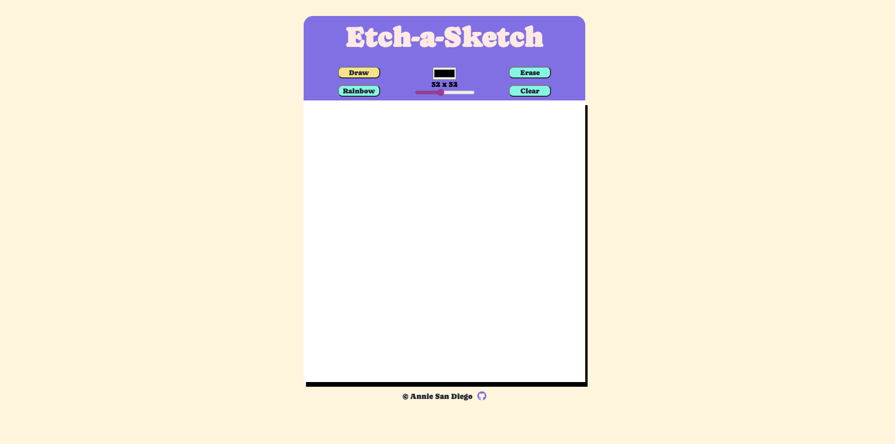

# The Odin Project - Etch-a-Sketch

This is a solution to the Etch-a-Sketch Project on [The Odin Project](https://www.theodinproject.com/lessons/foundations-etch-a-sketch). It is a pixel-style sketch app built with Vanilla JS, CSS, and HTML.

## Screenshot

## Links

- Live Site URL: [https://amsandiego.github.io/etch-a-sketch](https://amsandiego.github.io/etch-a-sketch)
